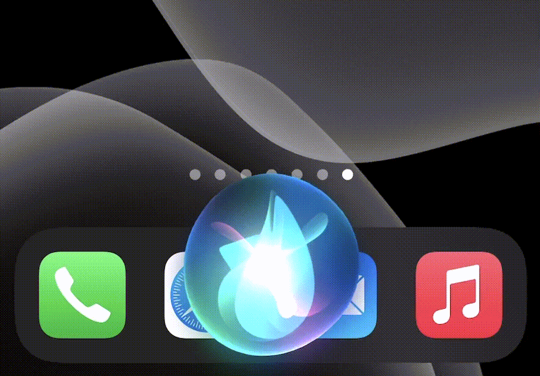

# 🌟 Ask Siri to buy some bitcoin for you

This application lets you instruct your own Zebpay account to buy bitcoin in it via Siri 🐉

> :warning: This application uses your own Zebpay account to perform the purchase. You are responsible to safe guard your own instance.

> :warning: Remember to safely withdraw your bitcoin back to your own wallet.


## Demo

[](https://twitter.com/harshjv/status/1320007969459691521)


## Prerequisites

1. [Vercel](https://vercel.com) account
2. [Zebpay Developer](https://build.zebpay.com/) account
3. [Shortcuts](https://apps.apple.com/us/app/shortcuts/id915249334) app


## Environment variables

```
API_PASSCODE=
APP_MAX_AMOUNT=
ZEBPAY_CLIENT_ID=
ZEBPAY_ACCESS_TOKEN=
```


## Deploy your own

[](https://vercel.com/new/git/external?repository-url=https%3A%2F%2Fgithub.com%2Fharshjv%2Fsiri-buy-bitcoin&env=APP_PASSCODE,APP_MAX_AMOUNT,ZEBPAY_CLIENT_ID,ZEBPAY_ACCESS_TOKEN)


## License

[MIT](./LICENSE.md)
